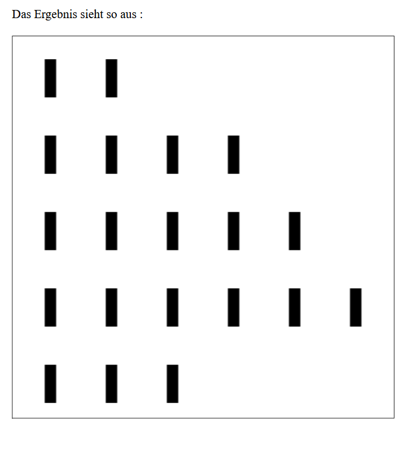

# 🕹️ Nim-Spiel – Java GUI Version

Dies ist eine einfache Java-Implementierung des klassischen **Nim-Spiels** mit grafischer Benutzeroberfläche , das mithilfe von **Turtle**  erstellt wurde.



---

## 📋 Spielregeln (kurz erklärt)

Das Nim-Spiel ist ein strategisches Spiel für zwei Spieler, bei dem abwechselnd Stäbchen entfernt werden. Der Spieler, der das letzte Stäbchen nimmt, **verliert** .

---

## 🛠️ Voraussetzungen

- Java Development Kit (JDK) 8 oder höher
- Beliebige Java-IDE (z. B. IntelliJ, Eclipse, NetBeans) oder einfach über die Konsole ausführbar

---

## ▶️ Kompilierung & Ausführung

1. **Kompilieren**:

```bash
javac nimView.java
```

2. **Ausführen**:

```bash
java nimView
```

---

## 🎨 Features

- Darstellung der Spielreihen als vertikale Stäbe (siehe Bild)
- LiveView mit Turtle zur Auswahl von Reihen und Anzahl der zu entfernenden Stäbchen
- Fortschritt wird visuell in Echtzeit aktualisiert
- Gewinn-Logik  enthalten

---

## 📁 Projektstruktur

```
.
├── nimView.java     // Hauptklasse mit Spiellogik  und Benutzeroberfläche-Implementierung  

└── NimView.png      // Beispielausgabe des Spiels (Screenshot)
```

---

